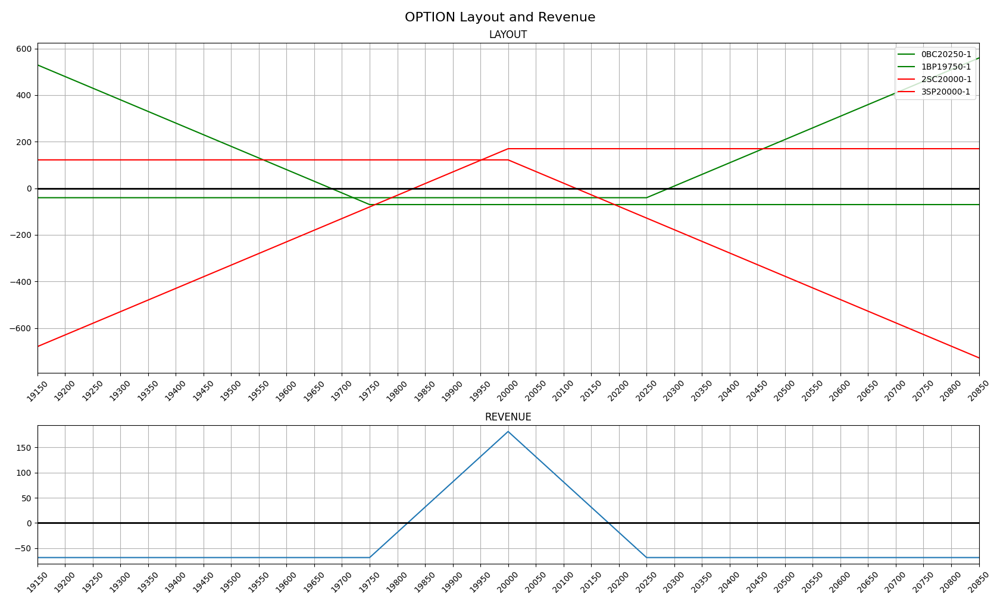

# 目的：
- 整合所有合約及損益分布（不計交易成本）。
  
# 系統環境：
-  Python 3.9
-  Module : pandas / matplotlib

# 使用方式：
###### from option_layout import OptionLayout
######
###### opt = OptionLayout()
###### opt.add('BC',20250,1,40.5)
###### opt.add('BP',19750,1,70)
###### opt.add('SC',20000,1,122)
###### opt.add('SP',20000,1,170)
###### opt.cal()
###### opt.show()

# 參數說明：
- add(買賣型態, 合約點數, 口數, 成本點數）
###### 買賣型態(BC: buy call / BP: buy put / SC: sell call / SP: sell put)    

# 合約LAYPUT:

